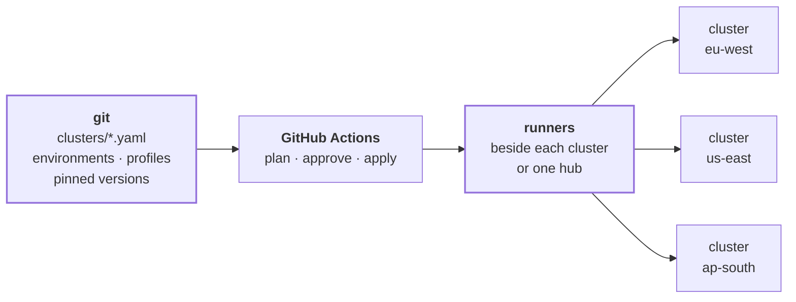
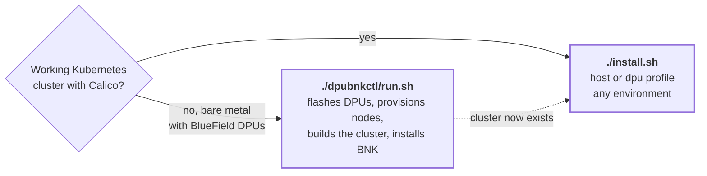
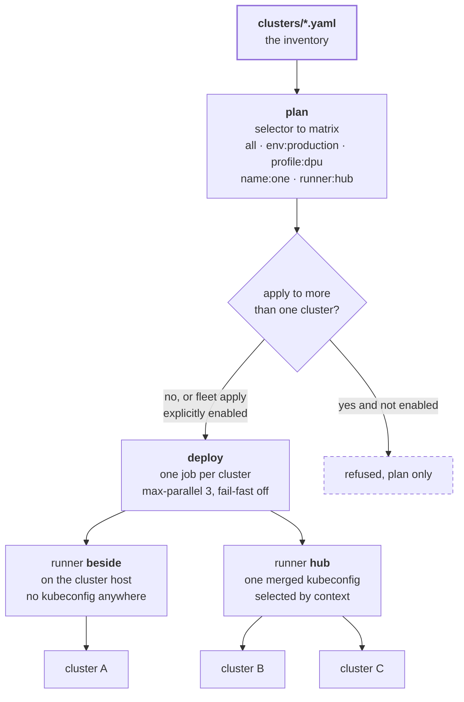
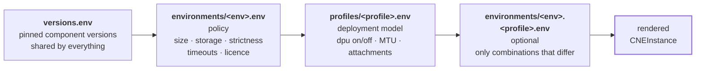
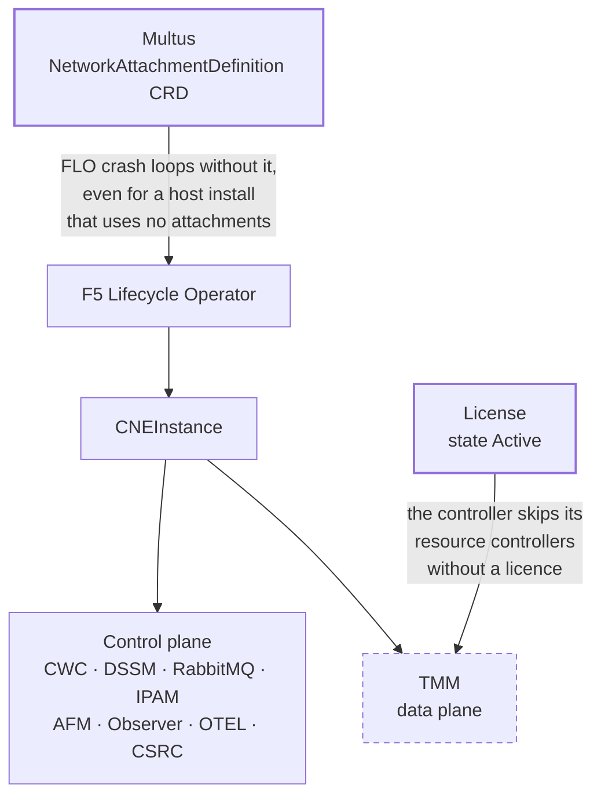

# bnk-deploy

**Install and operate F5 BIG-IP Next for Kubernetes across a fleet of clusters, from git.**

Built for teams running AI infrastructure at more than one site. If you operate GPU capacity across
several clusters, regions or tenants, installing BNK by following a procedure on each one does not
scale and does not stay consistent. This makes it declarative, repeatable and reviewable.



---

## What you get

**One command per cluster, or one run for the whole fleet.** `./install.sh --env production
--profile dpu` for a single cluster, or a dispatch that fans out across everything matching a
selector.

**Both BNK deployment models.** Host mode where TMM runs as a software pod, and DPU mode where it
runs on NVIDIA BlueField with DOCA offload. Every environment supports either, because a production
site may be software only or fitted with BlueField.

**Bare metal from nothing, too.** If you do not have a cluster yet, the DPU path wraps F5's own
`dpubnkctl` to flash BlueField cards, provision nodes, build the cluster and install BNK.

**Safe by default.** Every apply plans first. Applying across more than one cluster needs an
explicit opt in. Production makes every preflight warning fatal. Nothing installs on a merge.

**It knows the traps.** Five failure modes that are not in the official install guide are handled
before they bite you. They are listed further down, with what each one costs if you hit it blind.

**Pinned and reproducible.** Every component version is fixed in one file, including two that F5's
procedure has you discover at install time.

---

## Requirements

| | |
|---|---|
| Kubernetes | 1.30, the version BNK 2.3 is qualified against |
| CNI | **Calico** is the primary supported CNI. Flannel, VPC-CNI on EKS, OCI-CNI on Oracle and OVN-Kubernetes on OpenShift are recognised. Cilium is not supported |
| Nodes running TMM | hugepages allocated, because TMM uses DPDK |
| Storage | a default StorageClass |
| Access | outbound to `repo.f5.com`, plus `kubectl`, `helm` and `openssl` |
| From F5 | a registry credential and a licence token |

DPU mode additionally needs BlueField-3 cards, the SR-IOV device plugin advertising scalable
functions, and the node level work done. If that is not done, use the bare metal path instead.

---

## Quick start, one cluster

```bash
git clone https://github.com/iracic82/bnk-deploy.git && cd bnk-deploy

export FAR_PULL_JSON=/path/to/cne_pull_64.json      # your F5 registry credential
export BNK_LICENSE_JWT='eyJ...'                     # your F5 licence token

./install.sh --env lab --profile host --dry-run     # validate, change nothing
./install.sh --env lab --profile host               # install
./install.sh --env lab --phase 70                   # verify only
./uninstall.sh                                      # remove BNK, leave cert-manager and Calico
```

Re-running is safe. Every phase detects what already exists, so a second run is a no op rather
than a second install.

### The eight phases

Each can be run alone with `--phase NN`, which is how you debug a partial install without
starting over.

| | |
|---|---|
| 00 preflight | Tooling, cluster reachability, Kubernetes version, CNI identification, Multus CRD, StorageClass, hugepages. Fails fast |
| 10 prereqs | Multus, cert-manager, and the three object certificate authority chain |
| 20 registry | Registry login, namespaces, image pull secrets |
| 30 flo | The F5 Lifecycle Operator, which reconciles everything after it |
| 40 certs | CWC and OpenTelemetry certificates |
| 50 cneinstance | The CNEInstance, then waits for the stack |
| 60 licence | Applies the licence and reports whether it activates |
| 70 verify | Assertions, non zero exit on failure |

---

## Two paths in



The bare metal path wraps F5's `dpubnkctl`. Its published procedure leaves four manual blocks in
the middle, configuring OVS bridges on the DPU, applying netplan on the host, and setting up
kubeconfig. Those become the post-scripts the tool already hooks, so the whole build is one
command. Every site specific value, interface names, addresses, bridge names and DPU count, lives
in `dpubnkctl/env/<site>.env` rather than in the scripts.

---

## Many clusters

Add a file to `clusters/` and the cluster is in the fleet. That is the whole onboarding step, so it
happens in a pull request rather than in someone's head.

```yaml
# clusters/eu-west-prod.yaml
name: eu-west-prod
description: Production inference cluster, Frankfurt, BlueField fitted.

runner: beside                 # beside | hub
runner_label: eu-west-prod-1

environment: production        # lab | demo | staging | production
profile: dpu                   # host | dpu

kube_context: eu-west-prod
storage_class: nfs
pod_cidr: 192.168.0.0/16

enabled: true
```



Then from the Actions tab, run **dispatch**:

```
select: all              action: plan     # dry run every enabled cluster, always safe
select: env:production   action: apply    # needs BNK_FLEET_APPLY_ENABLED
select: name:eu-west-prod action: apply   # one cluster, no gate needed
select: profile:dpu      action: verify   # health check every DPU cluster
```

An apply touching more than one cluster is refused unless the repository variable
`BNK_FLEET_APPLY_ENABLED` is `true`, so the worst an accidental run can do is plan. One cluster
failing never stops the rest of the fleet, and parallelism is capped so a fleet run does not
saturate your runners or the registry.

### Where the runners go

**`runner: beside`** puts a self hosted runner on the cluster's own host. It already has kubectl
access, so no kubeconfig is stored anywhere and **nothing reaches inbound into your network**. This
is the right choice for production, for air gapped sites, and for anything behind a firewall.

**`runner: hub`** uses one runner holding a single merged kubeconfig with a context per cluster.
Fewer runners to maintain, and it reaches clusters that cannot host one. The trade is that the hub
can reach every cluster in its kubeconfig, so it deserves the same protection as a jump host.

Mix both in one fleet. Register a host with:

```bash
GH_RUNNER_TOKEN=$(gh api -X POST repos/OWNER/REPO/actions/runners/registration-token -q .token)

sudo -E ./bootstrap/install-runner.sh \
  --repo OWNER/REPO --label eu-west-prod-1 --env production --profile dpu
```

It refuses to register a host that cannot reach a cluster, installs what the workflows need, and
runs as a systemd service so it survives reboots.

---

## Environments and profiles

Two independent axes. The **environment** sets policy. The **profile** sets the deployment model.
Any environment runs either profile.

| | lab | demo | staging | production |
|---|---|---|---|---|
| Default profile | host | host | dpu | dpu |
| Deployment size | Small | Medium | Large | Large |
| Storage class | standard | standard | nfs | nfs |
| Core collection | off | off | on | on |
| Licence required | no | yes | yes | yes |
| Warnings fatal | no | no | no | **yes** |
| Wait timeout | 600s | 900s | 1800s | 2400s |

| | host | dpu |
|---|---|---|
| `dpu.enabled` | false | true |
| TMM MTU | 1500 | 9000 |
| Network attachments | none | `sf-external`, `sf-internal` |
| Dynamic routing | off | on |
| Needs SR-IOV | no | yes |



Later layers win. The combination file exists for cases like a production site on host mode, where
jumbo frames are a DPU fabric concern and the MTU should stay at 1500 rather than inherit 9000.

Two guardrails are worth knowing. Outside lab, `--skip-license` is an error, so nobody ships an
unlicensed demo by accident. In production every preflight warning is fatal, so a missing
StorageClass stops the run instead of producing a cluster that half works.

---

## The five traps this handles for you

All were found by running the install, not by reading about it. Each one costs real time if you
meet it without warning.



**1. The operator will not start without the Multus CRD.** Even for a host install that uses no
network attachments, the Lifecycle Operator crash loops on `if kind is a CRD, it should be
installed before calling Start`. Nothing in the install guide mentions this, and the error does not
point at Multus. Phase 10 installs Multus before phase 30 installs the operator, and phase 30
restarts the operator if it finds it looping, so the ordering is self healing.

**2. Two component versions are discovered, not published.** The procedure has you grep the
Lifecycle Operator and cert generation versions out of a release manifest at install time, which
makes every run potentially different. They are resolved and pinned in `versions.env`.

**3. The certificate authority CommonName must differ from the leaf CommonNames.** If it does not,
the licensing component crash loops on an x509 error that gives no hint why. The chain is built
correctly and the result is asserted to actually be a CA rather than assumed.

**4. Multus runs out of memory under BNK.** BNK creates enough pods to flood it with CNI requests
and the default limit is not enough. Raised up front rather than left as a troubleshooting step
after pods fail to start.

**5. An unlicensed install has no data plane, by design.** Without a licence the controller logs
`License is not enabled.. skip Resource controllers` and never creates TMM. The whole control plane
comes up and the data plane does not. Verification reports that as expected rather than as a fault,
so you are not left hunting a problem that is not there.

---

## Workflows

| Workflow | Trigger | Runs on | Does |
|---|---|---|---|
| `validate` | PR, push | hosted | shellcheck, actionlint, contract tests, renders every environment and profile combination, refuses floating versions, scans for committed credentials |
| `plan` | PR, dispatch | self hosted | server side dry run against the real cluster, posts the plan as a PR comment |
| `deploy` | dispatch | self hosted | plans then applies, or verifies, or uninstalls. Locked per cluster so two runs cannot race |
| `dispatch` | dispatch | hosted then self hosted | fleet wide, selector to matrix, fans out to `deploy` |
| `cluster-check` | dispatch, daily | self hosted | verification only, drift detection |
| `e2e-kind` | PR, push | hosted | throwaway 1.30 cluster with Calico, installs twice to prove idempotency |
| `dpubnkctl-deploy` | dispatch | jumphost | bare metal DPU build |

A merge never applies to a cluster. Installing is always a deliberate act.

---

## Secrets

Nothing sensitive is committed, and CI fails the build if anything credential shaped appears.

| Secret | Used by | What it is |
|---|---|---|
| `FAR_PULL_B64` | all install paths | Your F5 registry credential, the contents of `cne_pull_64.json` |
| `BNK_LICENSE_JWT` | licensed installs | Your F5 licence token |
| `HUB_KUBECONFIGS` | hub runners only | One merged kubeconfig with a context per cluster |
| `FAR_AUTH_KEY_B64` | bare metal path | The FAR auth key, the format `dpubnkctl` expects |

Store them per GitHub Environment so staging and production credentials are separate and gated by
reviewers. Runners that sit beside their cluster need **no kubeconfig secret at all**.

---

## Validation status

Honest about what has and has not been proven, because a deployment tool that overstates its
testing is worse than one that says nothing.

**Verified** on a three node Kubernetes 1.30 cluster with Calico. Full install clean end to end,
the operator running with 22 custom resource definitions registered, the control plane distributed
across all three nodes with every container ready, and a second run a complete no op. All eight
environment and profile combinations validate server side and render correctly differing objects.
Both runner topologies exercised, including a context that does not exist failing rather than
silently operating on the wrong cluster.

**Not yet verified**, and this is the honest gap: a **licensed** install. Everything downstream of
the licence activating, TMM included, is unexercised. The licence gate sits in front of the data
plane entirely, so an unlicensed run cannot reach it.

**DPU mode** is validated as far as rendering and preflight. The node level work, flashing and
scalable functions, needs real BlueField hardware to prove.

---

## Scope

This installs and operates BNK on Kubernetes. It does not do node provisioning, meaning DOCA
installs, BlueField flashing, OVS bridges, kernel parameters and `kubeadm`, because those are
imperative, need reboots and are not Kubernetes. Use the bare metal path for that, or your own
configuration management. A cluster reconciler should not own a file on a node.
