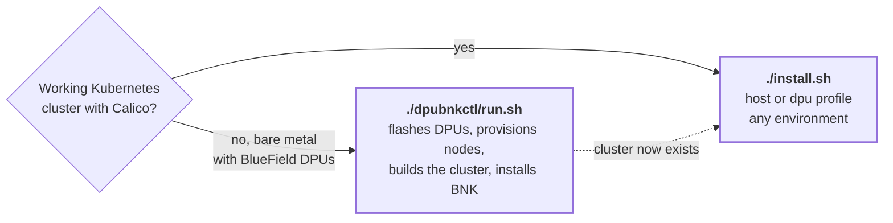
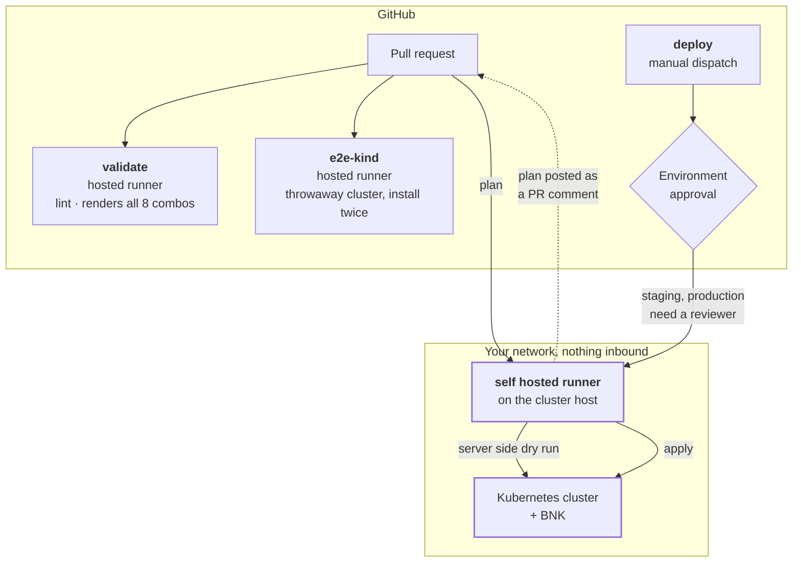
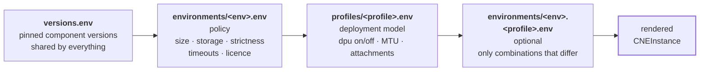
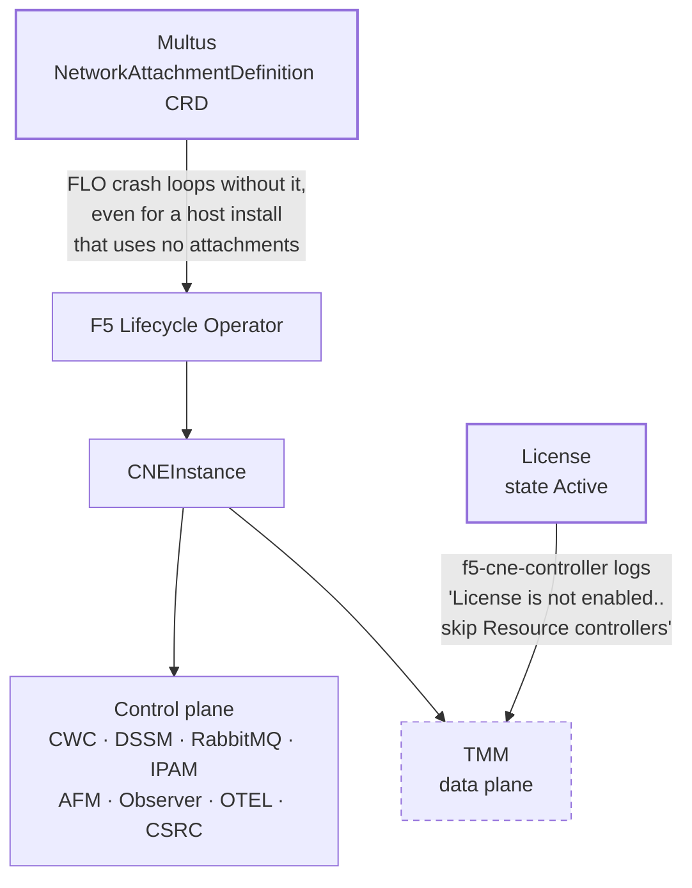

# bnk-deploy

Automated deployment for F5 BIG-IP Next for Kubernetes, driven from git.

The official install guide is a long sequence of copy and paste steps with manual blocks in the
middle. This turns it into something you run, review in a pull request, and repeat.

Two paths. Pick by what you already have.



---

## How to use it

### 1. Try it locally first

You need a Calico cluster, `kubectl`, `helm`, and the F5 registry credential `cne_pull_64.json`.

```bash
git clone https://github.com/iracic82/bnk-deploy.git && cd bnk-deploy

export FAR_PULL_JSON=/path/to/cne_pull_64.json

./install.sh --list-env                        # lab demo staging production
./install.sh --list-profile                    # host dpu

./install.sh --env lab --profile host --dry-run --skip-license   # change nothing
./install.sh --env lab --profile host --skip-license             # actually install
./install.sh --env lab --phase 70                                # just verify
./uninstall.sh                                                   # remove BNK
```

Re-running is safe. Every phase detects what already exists.

### 2. Put a runner on the host

This is the part that makes it CI/CD rather than a script someone remembers to run. The runner
lives **on the host that owns the cluster**, so no kubeconfig is ever stored as a repository
secret and nothing has to reach into your network from outside.

```bash
# get a short lived registration token
GH_RUNNER_TOKEN=$(gh api -X POST repos/iracic82/bnk-deploy/actions/runners/registration-token -q .token)

sudo -E ./bootstrap/install-runner.sh \
  --repo iracic82/bnk-deploy \
  --label tokyo-dpu-1 \
  --env production \
  --profile dpu
```

It checks the host can actually reach a cluster before registering, installs helm, `sshpass` and
`yq` for the DPU path, and installs itself as a systemd service so it survives reboots.

Then add the host to [`fleet/runners.yaml`](fleet/runners.yaml) so the fleet is documented in git,
and copy [`bootstrap/site.yml`](bootstrap/site.yml) per site if you want the host facts reviewable.

### 3. Create the GitHub environments

One per environment name, under Settings then Environments:

| Environment | Reviewers | Secrets |
|---|---|---|
| `bnk-lab` | none | `FAR_PULL_B64` |
| `bnk-demo` | none | `FAR_PULL_B64`, `BNK_LICENSE_JWT` |
| `bnk-staging` | required | `FAR_PULL_B64`, `BNK_LICENSE_JWT` |
| `bnk-production` | required | `FAR_PULL_B64`, `BNK_LICENSE_JWT` |

`FAR_PULL_B64` is the contents of `cne_pull_64.json` pasted as is, it is already base64.
There is deliberately no `KUBECONFIG` secret. The runner already has cluster access.

### 4. Day to day



The runner lives beside the cluster, so nothing reaches into your network and no kubeconfig is
ever a repository secret.


| You do | What happens |
|---|---|
| Open a pull request | `validate` lints and renders every environment and profile combination. `plan` runs a server side dry run on the target host and **posts the result as a PR comment**. |
| Merge | `validate` and `e2e-kind` run. Nothing is applied to a real cluster by a merge. |
| Run **deploy** | Manual dispatch. Pick runner, environment, profile. A plan runs first in the same job, then apply. Staging and production wait for a reviewer. |
| Nothing | `cluster-check` runs daily against the fleet as a drift check. |

Installing is never triggered by a merge. That is deliberate.

---

## Workflows

| Workflow | Trigger | Runs on | Does |
|---|---|---|---|
| `validate` | PR, push | hosted | shellcheck, pinned version check, renders all 8 env and profile combinations, scans for committed credentials |
| `plan` | PR, dispatch | **self hosted** | server side dry run, comments the plan on the PR |
| `deploy` | dispatch | **self hosted** | plan then apply, or uninstall. Concurrency locked per runner |
| `cluster-check` | dispatch, daily | **self hosted** | phase 70 verification only, drift detection |
| `e2e-kind` | PR, push | hosted | throwaway 1.30 cluster, install, then install again to prove idempotency |
| `dpubnkctl-deploy` | dispatch | **self hosted** jumphost | bare metal DPU build through F5's tool |

---

## Environments and profiles are independent

The **environment** decides policy. The **profile** decides the deployment model. Every
environment runs either, because a production site may be software only or fitted with BlueField.

```bash
./install.sh --env production --profile host    # software only production site
./install.sh --env production --profile dpu     # BlueField production site
```

Configuration layers, later wins:



Full matrix in [INSTALLER.md](INSTALLER.md).

Two guardrails. `BNK_REQUIRE_LICENSE` makes `--skip-license` an error outside lab, so nobody ships
an unlicensed demo. `BNK_STRICT_PREFLIGHT` makes every warning fatal in production, so a missing
StorageClass stops the run instead of producing a cluster that half works.

---

## The two gates that are not obvious

Both were found by running it. Neither is in the install guide.



So an unlicensed install brings up everything in the control plane box and nothing in the data
plane box, on any cluster, however it is configured. That is by design rather than a fault.

## What else this knows that the install guide does not

All five were found by running it, not by reading.

**FLO will not start without the Multus `NetworkAttachmentDefinition` CRD.** Even for a host
install that uses no attachments. It crash loops on `if kind is a CRD, it should be installed
before calling Start`. Phase 10 installs Multus before phase 30 installs FLO, and phase 30 bounces
FLO if it finds it restarting.

**Two versions are discovered, not published.** The guide has you grep the FLO and cert-gen
versions out of the release manifest at install time, which makes runs irreproducible. They are
pinned as `v2.21.13-0.0.28` and `0.9.3` from release manifest `2.3.0-3.2598.3-0.0.170`.

**The CA CommonName must differ from the leaf CommonNames** or CWC crash loops on an x509 error
that explains nothing. Phase 10 asserts `CA:TRUE` rather than assuming it.

**Multus OOMKills under BNK's CNI request volume** at its default memory limit. Raised to 512Mi up
front rather than left as a troubleshooting step.

**Hugepages are mandatory, not tunable.** TMM requests `hugepages-2Mi` and the operator keeps that
request even when you override `advanced.tmm.resources` to remove it. Tested by patching the
CNEInstance and watching the rendered `f5tmm` keep it.

---

## Verified, and what is not

Run against a real Kubernetes 1.30 cluster with Calico, host profile, unlicensed.

| | |
|---|---|
| Preflight | passes, correctly warns on missing hugepages |
| Multus, cert-manager, CA chain | pass, `CA:TRUE` asserted |
| FLO `v2.21.13-0.0.28` | running, 22 F5 CRDs registered |
| CNEInstance | applied, 9 of 9 pods in `f5-bnk`, 10 in `f5-cne-core` |
| Second run | idempotent, every phase detected existing state |
| All 8 env and profile combinations | validate server side, rendered objects differ correctly |
| **Three node cluster**, 1 control plane + 2 workers | full install clean. Calico and Multus spread as DaemonSets, `f5-dssm-db` and `f5-dssm-sentinel` distributed one replica per node, 13 pods in `f5-cne-core` and 9 in `f5-bnk`, every container ready |

**TMM cannot be verified without a licence, and that is by design.** `f5-cne-controller` logs
`License is not enabled.. skip Resource controllers` and never creates the TMM workload. So an
unlicensed install correctly brings up the whole control plane and deliberately withholds the data
plane. `--skip-license` can never produce a running TMM, on any cluster, however it is configured.
Phase 70 knows this and reports it as expected rather than as a failure.

That means a licensed install is the one remaining untested path, including everything downstream
of `License` reaching `Active`. The eval token available during development had expired.

Two other things were ruled out along the way, worth recording so nobody re-chases them. On a
single node cluster `f5-spk-csrc`'s `f5-fluentbit` sidecar crash loops on a plugin load fault, and
it does not on three nodes, so that was a single node artefact. And allocating hugepages is
necessary but not sufficient: the node reports 4Gi allocatable and TMM still does not appear,
because the licence gate sits in front of scheduling entirely.

---

## Testing on a multi node cluster

`e2e-kind` runs a single node cluster, which is enough for regression but hides node selection,
taint behaviour and DaemonSet spread. For a multi node kind cluster the host needs two sysctls
raised first, because each node container runs its own kubelet, containerd and CNI agents and the
defaults are too low. This is a kind requirement, not a BNK one.

```bash
sudo sysctl -w fs.inotify.max_user_instances=512
sudo sysctl -w fs.inotify.max_user_watches=524288
sudo sysctl -w kernel.keys.maxkeys=500000

# persist
sudo tee /etc/sysctl.d/99-kind.conf <<EOF
fs.inotify.max_user_instances = 512
fs.inotify.max_user_watches = 524288
kernel.keys.maxkeys = 500000
EOF
```

Without them `kind create cluster` fails during kubeadm on the second node with an error that does
not mention inotify.

## Secrets

Never committed. `.gitignore` blocks `*.jwt`, `cne_pull_64.json`, `f5-far-auth-key.tgz` and
`kubeconfig`, and `validate` fails the build if anything credential shaped appears.

| Secret | Path | For |
|---|---|---|
| `cne_pull_64.json` | `install.sh` | Registry pull. A base64 wrapped GCP service account for the Artifact Registry behind `repo.f5.com` |
| `f5-far-auth-key.tgz` | `dpubnkctl/` | FAR auth, the format F5's tool expects |
| Licence JWT | both | `operationMode: connected` validates against F5 live, so a stale token fails at apply time with a fully built cluster |

---

## Node provisioning is out of scope for install.sh

DOCA installs, BlueField flashing, scalable functions, OVS bridges, GRUB hugepages and `kubeadm`
are imperative, need reboots, and are not Kubernetes. Either use `./dpubnkctl/run.sh`, which wraps
F5's tool and does all of it, or put it in Ansible. Do not make a cluster reconciler own a file on
a node.
